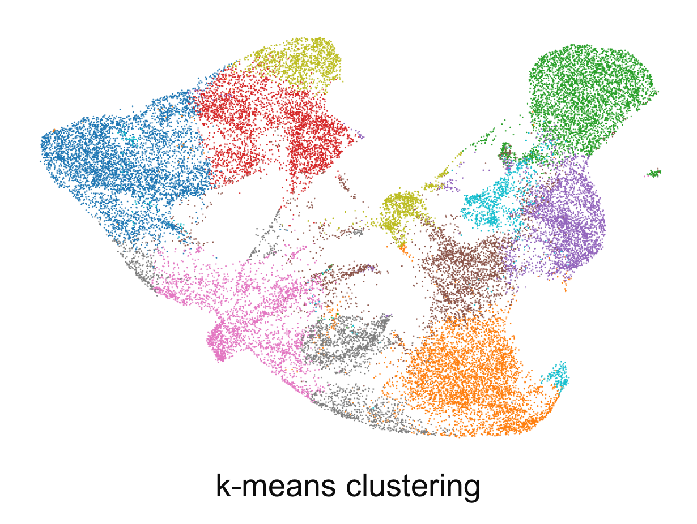
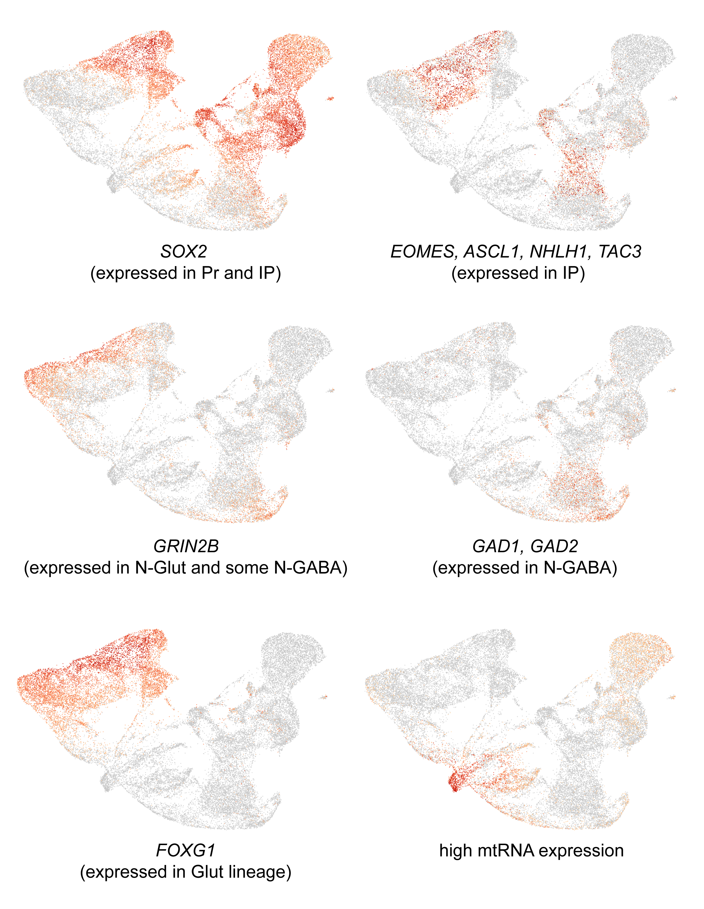
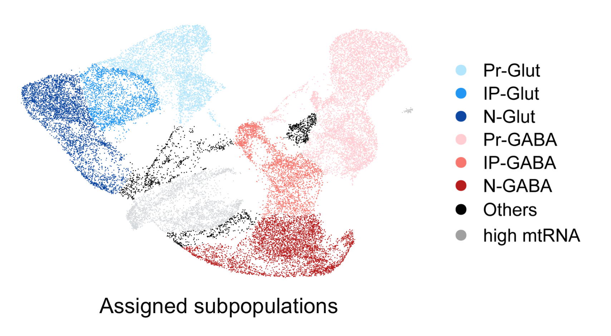
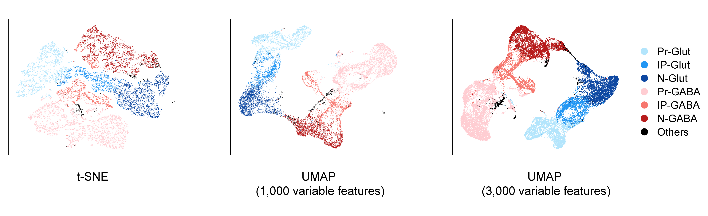

Annotation and assignment of cellular subpopulations in scRNA-Seq data of brain organoids derived from Pitt-Hopkins Syndrome patients and respective parents of matching sex.

---

## Initial clustering

For the assignment of cellular subpopulations in the single cell RNA sequencing data, we first imported the processed gene count data generated using [Cell Ranger](https://support.10xgenomics.com/single-cell-gene-expression/software/pipelines/latest/what-is-cell-ranger) (version 4.0.0) to [Loupe Browser](https://www.10xgenomics.com/products/loupe-browser) software (10x Genomics, Inc.) and analyzed them to partition the cells into groups using k-means clustering ($k=8$, UMAP embedding below).

```{r, echo=FALSE, out.width="47%", fig.align="center"}
library("knitr")

```

## Refinement of cell clusters

Next, we visually inspected the expression of each marker gene in each k-means-assigned subpopulation and manually adjusted the subpopulation boundaries based on the expression pattern of these genes. Examples of genes and marker sets used for this adjustment step can be seen in the corresponding UMAP embeddings below.

```{r, echo=FALSE, out.width="70%", fig.align="center"}

```

Assignment of each subpopulation was based on the intersection between these marker sets to obtain biologically relevant populations. For example, the Pr-Glut subpopulation was defined by examination of the k-means clusters followed by adjustment based on the expression of the glutamatergic lineage marker *FOXG1* and the highest expression levels of *SOX2*. IP-Glut cells were delimited after examination of the k-means clusters adjusted based on those cells not assigned to the Pr-Glut population and that expressed *FOXG1* and IP makers *EOMES*, *ASCL1*, *NHLH1*, and *TAC3*. N-Glut cells were delimited based on those *FOXG1*^+^ cells not included in the Pr-Glut and IP-Glut groups and that expressed *GRIN2B*. Similar intersectional procedure was followed for assigning subpopulations in the GABAergic lineage, including the use of N-GABA markers *GAD1* and *GAD2*. Cells with high expression of mtDNA genes were considered apoptotic cells and discarded from downstream analyses. Cells that independently clustered in the k-means analysis and that could not be unequivocally assigned to the other populations described above were included in the “Others” category. The UMAP embedding below shows the refined result after assignment of each of these populations.

```{r, echo=FALSE, out.width="60%", fig.align="center"}

```

The combined approach of first performing unbiased determination of subpopulations followed by manual refinement maximizes the identification of biologically relevant groups of cells. It is evident that these subpopulations could be further subdivided into other groups of cells, but we decided to focus on groups containing progenitors, intermediate progenitors, and neurons in the excitatory and inhibitory lineages.

## Assessment of cluster stability

Importantly, these subpopulations remain stably clustered together in t-SNE or UMAP embeddings (using 1,000 or 3,000 variable features, selected with the `FindVariableFeatures` function) generated using [Seurat](https://satijalab.org/seurat/) (version 3.2.2) [@stuart_comprehensive_2019], as shown in the graphs below.

```{r, echo=FALSE, out.width="100%", fig.align="center"}

```

## References

<div id="refs"></div>
<br>
